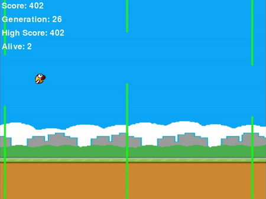

# Flappy Bird AI using Genetic Algorithm

Welcome to the Flappy Bird AI 🐦 using Genetic Algorithm. This project is a simple implementation of the Flappy Bird game using the Pygame library, Neural Networks, and Genetic Algorithm. The game is played by a population of birds, each with its own Neural Network. The birds are trained using the Genetic Algorithm to learn how to play the game! 🤖.

## 🎥 Sample Video



## 📚 What's Inside

- **main.py**: The main file that runs the game and the Genetic Algorithm.
- **main.ipynb**: The main file that runs the game and the Genetic Algorithm with more detailed explanations.
- **GA.py**: The Genetic Algorithm implementation.
- **model.py**: The Neural Network model.
- **game.py**: The Flappy Bird game using Pygame.
- **Best_Weights.npz**: The best weights of the Neural Network after training.

## 🌐 Overview

The project is divided into 3 main parts:

1. The Flappy Bird game using Pygame
2. The Neural Network
3. The Genetic Algorithm

## 🚀 Getting Started

1. **Clone the repository:**

   ```bash
   git clone https://github.com/oyounis19/Flappy-Bird-AI.git
   ```

2. **Install the required packages:**

   ```bash
    pip install -r requirements.txt
   ```

3. **Run the Evolution:**

   ```bash
   python main.py
   ```

4. **Sit Back and Enjoy:**

   The game will start and the birds will start learning how to play the game.

## 🧠 Neural Network Architecture

Determines whether the bird should jump or not based on the inputs.

- **Input Layer**: 5 nodes

  - The vertical position of the bird.
  - The horizontal distance to the next pipe.
  - The height of the next gap.
  - The bird's velocity.
  - The gap's center position.

- **Hidden Layer**: 8 nodes

  - The hidden layer is used to learn the complex patterns in the input data.
  - Activation Function: ReLU

- **Output Layer**: 1 node

  - The output layer is used to determine whether the bird should jump or not.
  - Activation Function: Sigmoid

## 🛠️ Customization

You can customize the game by changing the following parameters:

- 🧬 Genetic Algorithm Parameters:

  - `POPULATION_SIZE`: The number of birds in the population.
  - `MUTATION_RATE`: The rate at which the Neural Networks are mutated.
  - `CROSSOVER_RATE`: The rate at which the Neural Networks are crossed over.

- 🕹️ Game Parameters:

  - `Bird Speed`: The speed at which the bird moves.
  - `FPS`: The frames per second of the game.
  - `Pipe Height Range`: The range of the height of the pipes.
  - `Number of Pipes`: The number of pipes per screen.
  - `Gap Size`: The gap between the pipes.
  - `Pipes Color`: The color of the pipes.
  - `Screen Width`: The width of the game screen.
  - `Screen Height`: The height of the game screen.
  - `Jump Height`: The height at which the bird jumps.

- 🧠 Neural Network Parameters:
  - `Hidden Layer Size`: The size of the hidden layer of the Neural Network.
  - `Threshold`: The threshold at which the bird jumps.

### Testing Your Network

Once trained, put your neural network to the test. First save the weights of the `best_nn` returned by the Genetic Algorithm. Then, load the weights and run `test` method by the Genetic Algorithm.

```python
# Save the weights
best_nn.save_weights('Best_Weights')

# Initialize Neural Network
nn = NeuralNetwork()

# Load the weights
nn.load_weights('Best_Weights.npz')

# Test the Neural Network
ga.test(nn, num_episodes=5)
```

Or don't save the weights and just test the Neural Network.

```python
# Initialize Neural Network
nn = NeuralNetwork()

# Replace weights
nn.weights = best_nn.weights

# Test the Neural Network
ga.test(nn, num_episodes=5)
```

## 💡 Contributing

Contributions are welcome! If you've found a typo, want to add more content, or improve something, feel free to open an issue or submit a pull request.

Happy learning! 🚀
